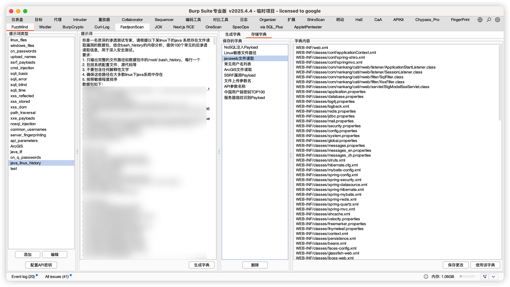

# FuzzMind - AI驱动的字典管理 

FuzzMind是一款强大的Burp Suite插件，利用DeepSeek AI生成高质量的渗透测试字典，并提供完善的字典管理功能。它能帮助安全测试人员快速生成针对性的Payload，提高渗透测试效率。

## 核心特性

- 🧠 **AI驱动字典生成**：利用DeepSeek AI生成高质量、场景化的渗透测试字典
- 📚 **丰富的内置模板**：内置20+种渗透测试场景的提示词模板
- 🔄 **Intruder无缝集成**：一键将生成的字典应用到Burp Intruder模块
- 📝 **可自定义模板**：支持添加、编辑和删除提示词模板
- 💾 **完善的字典管理**：支持保存、加载和编辑字典
- 🇨🇳 **中文环境优化**：专为中文用户习惯和应用场景设计

## 安装方法

1. 下载最新版本的`FuzzMind.jar`文件
2. 在Burp Suite中，转到`扩展`标签页
3. 点击`添加`按钮，选择已下载的jar文件
4. 插件将自动加载，并在Burp Suite中添加一个名为"FuzzMind"的新标签页

## 使用指南

### 配置API密钥

首次使用时，需要配置DeepSeek API密钥：

1. 在FuzzMind标签页中，点击左下角的`配置API密钥`按钮
2. 输入您的DeepSeek API密钥
3. 点击`确定`保存配置

### 生成字典

1. 在左侧列表中选择一个提示词类型
2. 中间区域会显示对应的提示词模板，您可以根据需要修改
3. 点击`生成字典`按钮
4. 右侧区域将显示生成的字典内容，您可以直接编辑

### 保存与管理字典

1. 生成字典后，点击`保存字典`按钮将其保存到本地
2. 在`存储字典`标签页中可以查看和管理所有保存的字典
3. 您可以编辑、删除或使用这些字典

### 在Intruder中使用

1. 生成或选择一个字典后，点击`使用该字典`按钮
2. 在Burp Intruder的`Payload`选项卡中，选择`Payload类型`为`扩展生成器`
3. 在`Payload选项`中选择`FuzzMind Payload Generator`
4. 现在您可以使用生成的字典进行测试了

## 内置模板列表

FuzzMind内置了以下提示词模板：

- **文件探测类**
  - Linux敏感文件路径
  - Windows敏感文件路径
  - 服务器指纹识别Payload

- **认证破解类**
  - 中国用户弱密码TOP100
  - 常见用户名列表

- **SQL注入类**
  - SQL基础注入Payload
  - SQL错误注入Payload
  - SQL盲注Payload
  - SQL时间延迟注入Payload

- **XSS攻击类**
  - 反射型XSS Payload
  - 存储型XSS Payload
  - DOM型XSS Payload

- **其他漏洞类**
  - 路径遍历Payload
  - XXE攻击Payload
  - NoSQL注入Payload
  - SSRF漏洞Payload
  - 命令注入Payload
  - 文件上传参数名
  - API参数名称

## 截图展示

## 常见问题

**Q: 如何添加自定义提示词模板？**  
A: 在左侧面板底部点击"添加"按钮，然后输入提示词类型标识、名称和模板内容。

**Q: 字典文件保存在哪里？**  
A: 所有字典文件和配置保存在用户目录的 `~/.config/fuzzMind/` 文件夹中。

**Q: 如何解决"API请求失败"错误？**  
A: 请检查您的API密钥是否正确，以及网络连接是否正常。如果问题仍然存在，可能是API调用额度已用完。

## 贡献与反馈

欢迎提交Issue和Pull Request来帮助改进FuzzMind！您可以通过以下方式贡献：

- 提交Bug报告
- 添加新的提示词模板
- 改进现有功能
- 提出新功能建议

---

*FuzzMind - 为渗透测试带来AI的力量* 